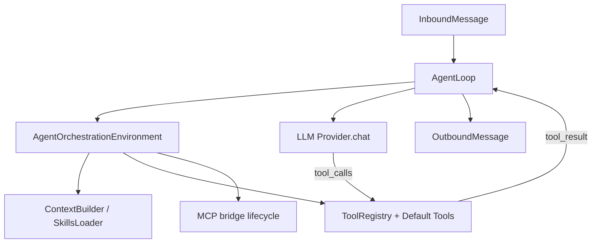

# 应用编排层：Skill / MCP / AgentLoop 解耦说明

本文档描述 nanobot 新增的**应用层编排环境**，用于解耦 `skill`、`MCP` 与 `AgentLoop` 的运行时职责。

## 目标

把原本 `AgentLoop` 中混合的三类职责拆开：

1. **Skill 上下文编排**：系统提示构建、Skill 摘要注入。  
2. **工具编排**：注册默认工具（文件、exec、web、message、spawn、cron）。  
3. **MCP 生命周期**：惰性连接、失败重试、统一关闭。

现在这些职责由 `AgentOrchestrationEnvironment` 承担，`AgentLoop` 专注于消息循环与 tool-call 驱动。

## 新增组件

- `nanobot/application/orchestration/environment.py`
  - `AgentOrchestrationEnvironment`
  - 负责 `ContextBuilder`、`ToolRegistry`、`SubagentManager` 的装配
  - 负责默认工具注册
  - 负责 MCP 的 `ensure_mcp_connected()` 与 `close()`
- `nanobot/application/orchestration/__init__.py`
  - 暴露应用层编排入口

## 交互关系

## 运行时流程（简化）

1. `AgentLoop.run()` 启动时调用 `env.ensure_mcp_connected()`（惰性，失败可重试）。
2. 收到消息后，`AgentLoop` 通过 `env.context` 构建 system prompt（含 skills summary）。
3. `AgentLoop` 调用模型，若返回 tool call，则通过 `env.tools.execute()` 执行。
4. 工具结果继续回灌模型，直到得到最终回答。
5. 进程结束或重启前，`AgentLoop.close_mcp()` 委托 `env.close()` 释放 MCP 连接。

## 关键收益

- **职责单一**：`AgentLoop` 不再持有 MCP 连接细节与工具注册细节。  
- **可扩展性更好**：应用层可以在不改主循环的前提下增加编排策略（如策略过滤、按会话工具集）。  
- **可测试性提升**：环境构建与主循环逻辑可分开测试。

## 与现有能力兼容性

- Skill 机制保持不变：仍由 `ContextBuilder` + `SkillsLoader` 生成可读 skill 提示。  
- MCP 能力保持不变：仍通过现有 `connect_mcp_servers()` 注册为可调用工具。  
- CLI/Gateway 调用方式不变：`AgentLoop` API 未改动。

## 后续建议

- 可以继续把“工具策略过滤”“消息路由策略”也逐步沉淀到 application 层，形成统一编排管道。  
- 如需支持多编排模式（轻量/企业），可基于 environment 做不同 profile 工厂。

